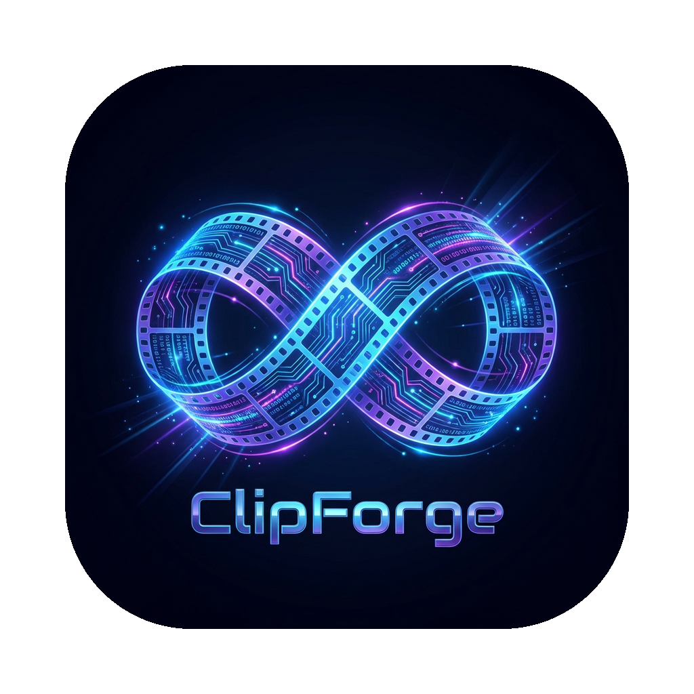
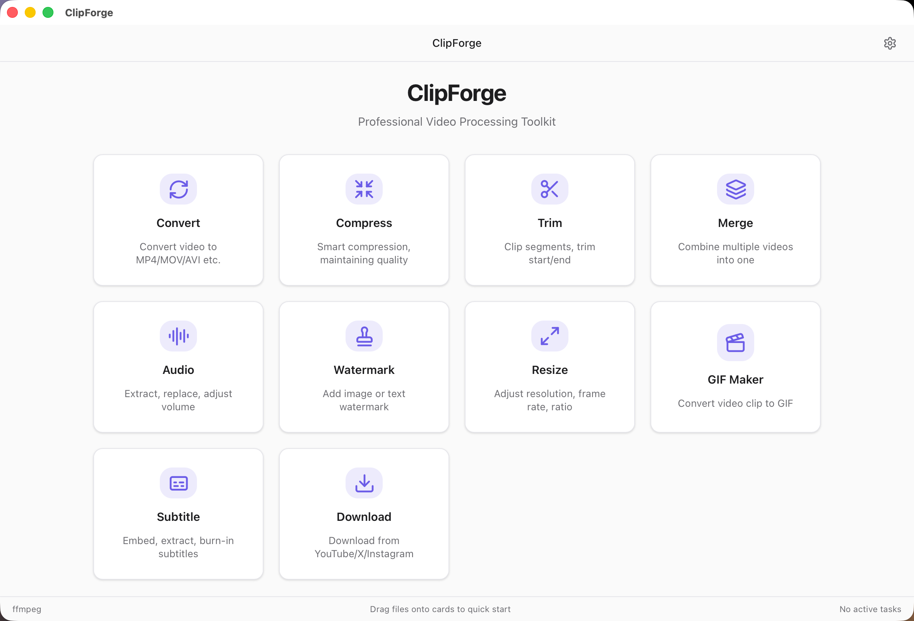
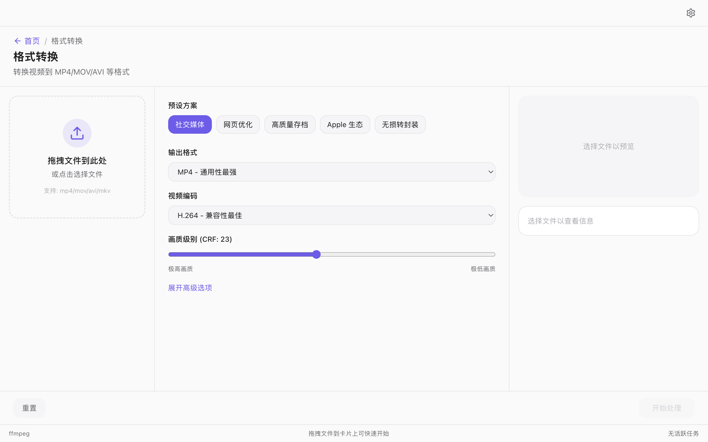

<p align="center">
  
</p>

<h1 align="center">ClipForge</h1>

<p align="center">
  <strong>A professional desktop video toolbox powered by FFmpeg & yt-dlp</strong><br>
  Format conversion, compression, trimming, merging, downloading and more — all in one app.
</p>

<p align="center">
  <a href="https://github.com/yummysource/clipforge/releases"></a>
  
  
  <a href="LICENSE"></a>
</p>

<p align="center">
  <a href="docs/README_zh.md">🇨🇳 中文文档</a>
</p>

---

<p align="center">
  
</p>

## Features

| Feature | Description |
|---------|-------------|
| **Format Conversion** | Convert between MP4 / MKV / MOV / WebM / AVI / TS / FLV with encoding presets |
| **Video Compression** | Light / Moderate / Heavy presets, compress by quality level or target size |
| **Trim & Cut** | Visual timeline selector, multi-segment extraction |
| **Merge** | Drag-and-drop reordering, merge multiple videos into one |
| **Audio Processing** | Extract audio, replace soundtrack, adjust volume |
| **Watermark** | Text or image watermarks with custom position and opacity |
| **Resize** | 4K / 2K / 1080p / 720p presets, custom dimensions, Lanczos/Bicubic scaling |
| **GIF Maker** | Video-to-GIF with frame rate and dithering controls |
| **Subtitles** | Embed SRT/ASS/VTT subtitles, extract tracks, shift timeline |
| **Video Download** | Download from YouTube / X (Twitter) / Instagram with format selection |

<details>
<summary>More screenshots</summary>

**Format Conversion**



**Video Download**


</details>

## Tech Stack

- **Frontend**: React 19 + TypeScript + Tailwind CSS + Radix UI
- **Backend**: Rust + Tauri 2
- **Processing Engine**: FFmpeg / FFprobe (Sidecar)
- **Download Engine**: yt-dlp (Sidecar)
- **State Management**: Zustand

## Installation

### Download

Go to [Releases](https://github.com/yummysource/clipforge/releases) and download the latest `.dmg` installer.

> Currently supports **macOS (Apple Silicon)** only.

### macOS Security Note

On first launch, macOS may warn about an unverified developer. Run:

```bash
xattr -cr /Applications/ClipForge.app
```

## Building from Source

### Prerequisites

- [Node.js](https://nodejs.org/) >= 18
- [Rust](https://rustup.rs/) >= 1.70
- [FFmpeg](https://ffmpeg.org/) binary (placed in `src-tauri/` as sidecar)
- [yt-dlp](https://github.com/yt-dlp/yt-dlp) binary (placed in `src-tauri/` as sidecar)

### Build

```bash
git clone https://github.com/yummysource/clipforge.git
cd clipforge

npm install
npm run tauri dev    # development
npm run tauri build  # production build
```

### Sidecar Binaries

Tauri requires platform-named binaries in `src-tauri/`:

```
src-tauri/
├── ffmpeg-aarch64-apple-darwin
├── ffprobe-aarch64-apple-darwin
└── yt-dlp-aarch64-apple-darwin
```

> These binaries are large and excluded from Git. Download them for your target platform before building.

## Project Structure

```
src/                          # React frontend
├── components/               # Shared components (DropZone, FileList, VideoPreview ...)
├── pages/                    # Feature pages (10 features + settings)
├── hooks/                    # Custom React hooks
├── services/                 # Tauri invoke wrappers
├── stores/                   # Zustand state management
├── types/                    # TypeScript type definitions
└── lib/                      # Utilities and constants

src-tauri/                    # Rust backend
├── src/commands/             # Tauri IPC command handlers
├── src/engine/               # FFmpeg process management & arg builder
├── src/models/               # Data models
└── src/utils/                # Utility modules
```

## FAQ

<details>
<summary><strong>Why macOS (Apple Silicon) only?</strong></summary>

ClipForge bundles platform-specific binaries (FFmpeg, FFprobe, yt-dlp) as Tauri sidecars. The current release only includes `aarch64-apple-darwin` binaries. Windows and Linux support is planned for future releases.

</details>

<details>
<summary><strong>What version of FFmpeg is required?</strong></summary>

The bundled FFmpeg is version 8.x. If building from source, FFmpeg 6.0+ with H.264/H.265/VP9/AV1 encoder support is recommended.

</details>

<details>
<summary><strong>Will Intel Mac be supported?</strong></summary>

Intel Mac (`x86_64-apple-darwin`) support is feasible by providing the corresponding sidecar binaries. Contributions are welcome.

</details>

<details>
<summary><strong>Video download is slow or fails?</strong></summary>

Video downloading depends on yt-dlp and your network connection. Make sure you have a stable internet connection. Some platforms may require a VPN depending on your region.

</details>

<details>
<summary><strong>Where are output files saved?</strong></summary>

By default, output files are saved alongside the source file with an `_output` suffix. You can change the output directory and suffix in Settings.

</details>

## Contributing

Contributions are welcome! Please read [CONTRIBUTING.md](CONTRIBUTING.md) for guidelines.

## Changelog

See [CHANGELOG.md](CHANGELOG.md) for a history of changes.

## License

[MIT License](LICENSE)
